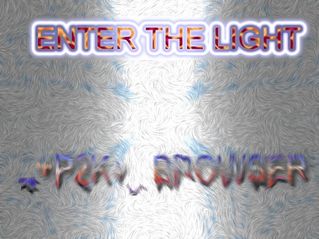



## v 1\.4 NEW VERSION \>\>\> \_\+P2K\+\_ Pop\-up less browser version 1\.4 \<\<\< NEW VERSION

### Description

New features include: Better skin making tutorial (with image sizes),NEW better search utility (featuring google, profusion, yahoo, dogpile, and of course, planet source code. how cool is that?) Warez downloader (not to be confused with my url maker, but it uses the same basic commands). Splash screen with customizable picture, progress bar, loading staus (all fake to give it a big program feel), take the delay off of the timer on the splash screen if you use the password in the fun and misc menu (the password is prgm) custom title, make it any color, Bug free, room for a picture on the main form (thou none are required) also includes: Savesetting and getsetting, independant homepage (NOT THE SAME AS YOUR DEFAULT BROWSERS like it used to be) and thats about it for the new stuff.

It is an advanced web browser that is skinnable, and fully customizable. "It is a great alternative to Internet Explorer 6." Someone brought to my attention that it IS internet explorer 6 control, therefore it used the IE engine. I guess it is like a customizable "skin" for ie rather than a replacement, although you COULD use ut in place of IE. It includes a custom color picker, and an IMG to ASCII converter (not written by me). warez downloader might be flakey, can someone please fix it up and send it to me?
 
### More Info
 

             |
---                |---
**Submitted On**   |2002-03-06 20:12:04
**By**             |[\_\+Seanp2k\+\_](https://github.com/Planet-Source-Code/PSCIndex/blob/master/ByAuthor/seanp2k.md)
**Level**          |Advanced
**User Rating**    |3.7 (11 globes from 3 users)
**Compatibility**  |VB 5\.0, VB 6\.0
**Category**       |[Internet/ HTML](https://github.com/Planet-Source-Code/PSCIndex/blob/master/ByCategory/internet-html__1-34.md)
**World**          |[Visual Basic](https://github.com/Planet-Source-Code/PSCIndex/blob/master/ByWorld/visual-basic.md)
**Archive File**   |[v\_1\_4\_NEW\_59983362002\.zip](https://github.com/Planet-Source-Code/seanp2k-v-1-4-new-version-p2k-pop-up-less-browser-version-1-4-new-version__1-32418/archive/master.zip)

